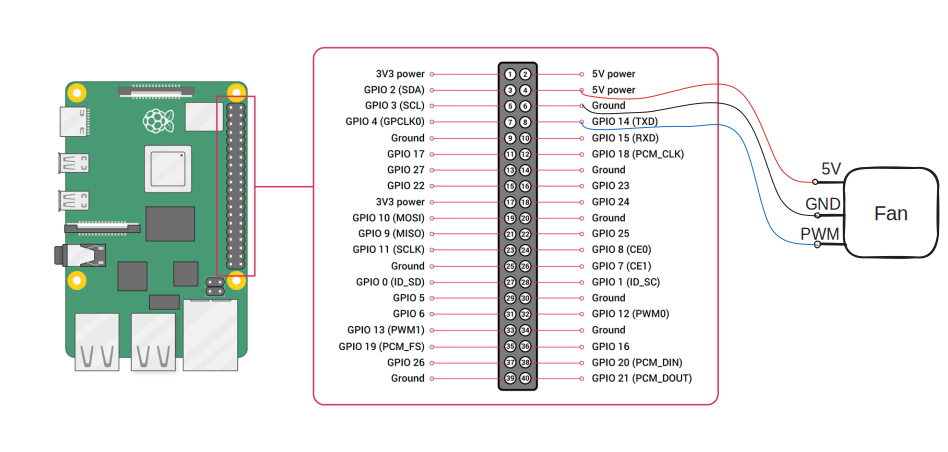

## Introduction

Raspberry Pi OS offered `raspi-config` for users to setup automatic control on a pulse width modulation (PWM) fan. It basically turns on the fan at the threshold and turns off the fan 10 degrees below the threshold. If we want more control on the fan, one possible way is to write a script and execute in background. Here will be done in Golang.

### Implementation

#### Wiring

We connect the power to a 5V pin, the ground to a ground pin and the PWM to a TXD pin.




#### Script

Then, we download the golang script from my repository:

https://github.com/sheldonip/raspberry-pi-4-fan-control/

We follow the setup and run in the terminal:

```sh
go run fan-control.go
```

The fan should be up when the temperature reaches `upperTemperatureThreshold` and stop at the temperature defined in `lowerTemperatureThreshold`. To executethe script in background, please follow the instruction in the readme file.

## Wrapping up

We have done the wiring for connecting a PWM fan to a raspberry pi 4 and executed a Golang script to control the fan. We now have more control on turning on and off the fan by adjusting the values of thresholds in the script.

## References

- https://www.raspberrypi.com/documentation/computers/raspberry-pi.html
- https://embeddedcomputing.com/technology/processing/interface-io/quick-start-raspberry-pi-gpio-terminal-interface
- https://github.com/stianeikeland/go-rpio
- https://github.com/MaksymBilenko/rpi-fan-control/blob/master/main.go

## Credits

Cover photo by [Stefan Cosma](https://unsplash.com/@stefanbc?utm_content=creditCopyText&utm_medium=referral&utm_source=unsplash) on [Unsplash](https://unsplash.com/photos/green-and-black-computer-motherboard-f3Yk7gW6chM?utm_content=creditCopyText&utm_medium=referral&utm_source=unsplash)
  